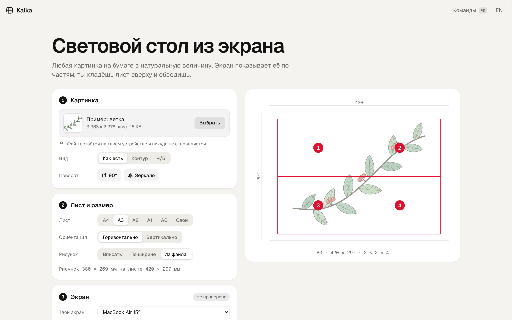
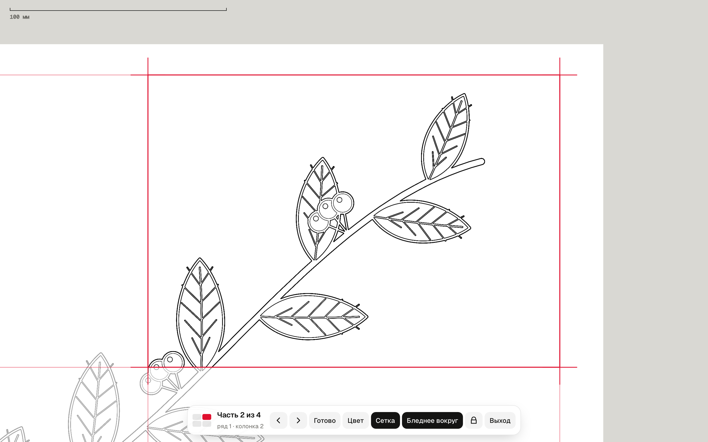

# kalka

световой стол из экрана ноутбука или планшета. любая картинка переносится на бумагу в натуральную величину: экран показывает её по частям, ты кладёшь лист сверху и обводишь.

**[открыть kalka →](https://kvyvo.github.io/kalka/)** · бесплатно, без регистрации, файл не покидает устройство · [english below](#english)



## зачем

плакат на ватмане А1, декорации к утреннику, эскиз для муралa, выкройка, перевод рисунка на ткань или под тату. рисовать от руки в масштабе сложно, проектора нет, а у телефонных AR-приложений свою картинку загрузить можно только по подписке, и изображение дрожит.

у ноутбука уже есть яркий плоский экран. осталось показать на нём рисунок ровно в миллиметрах и по кусочку за раз.

## что умеет

- **любой файл**: JPG, PNG, SVG, PDF, перетаскиванием, кнопкой или вставкой из буфера. размер из SVG (`width="380mm"`) и PDF подхватывается сам
- **любой лист**: A4…A0, горизонтально или вертикально, или свой размер. рисунок вписывается с полями, задаётся шириной в см или берётся из файла
- **натуральная величина**: экран определяется по разрешению (MacBook Air/Pro, iPad, Surface), для остальных вводится диагональ. проверка по любой пластиковой карте 85,6 × 54 мм: рамку можно двигать кнопками или тянуть за край
- **число частей само**: подбирается минимальное деление, при котором часть с запасом помещается на экран. можно задать вручную
- **режим обводки**: белый экран, текущая часть в красной рамке, соседние бледнее, за краем листа серая зона — лист совмещается по краю, без разметки. крестики в узлах для тех, кто размечает. отрезок 100 мм для проверки линейкой
- **замок**: ватман на клавиатуре не нажмёт пробел и не перелистнёт часть, касания на iPad не нажмут кнопки. снимается удержанием
- **контур из фото**: оператор Собеля в Web Worker, ползунок толщины. режим Ч/Б для рисунков, где линии уже есть. поворот и зеркало (для линогравюры и трафаретов)
- **печать на A4**, если материал не просвечивает: рисунок режется на листы в масштабе 1:1 с нахлёстом 10 мм для склейки и контрольным отрезком 50 мм
- **прогресс и проект**: отмеченные части, настройки и сам файл сохраняются в браузере (IndexedDB). проект можно выгрузить файлом `.kalka` и открыть на другом устройстве
- **офлайн** (PWA), **RU/EN**, светлая и тёмная тема, палитра команд <kbd>⌘K</kbd> / <kbd>Ctrl K</kbd>, всё проходится с клавиатуры



## клавиши в режиме обводки

| клавиша | что делает |
|---|---|
| <kbd>←</kbd> <kbd>→</kbd> <kbd>↑</kbd> <kbd>↓</kbd> | соседняя часть |
| <kbd>Enter</kbd> | часть готова, к следующей необведённой |
| <kbd>Пробел</kbd> / <kbd>⇧ Пробел</kbd> | следующая / предыдущая по порядку |
| <kbd>1</kbd>…<kbd>9</kbd>, <kbd>⌘K</kbd> + номер | перейти к части |
| <kbd>C</kbd> <kbd>G</kbd> <kbd>D</kbd> | цвет / сетка / бледнее вокруг |
| <kbd>L</kbd> | замок, снять — удерживать <kbd>Esc</kbd> или кнопку |
| <kbd>F</kbd>, <kbd>Esc</kbd> | во весь экран, выход |

клавиши работают и на русской раскладке.

## как это устроено

статический сайт без сборки и фреймворков: ES-модули, ~1 500 строк JS. зависимость одна и только для разработки (Playwright).

```
index.html, css/app.css
js/geometry.js   лист, вписывание, сетка, подбор числа частей, листы для печати — чистые функции
js/screens.js    таблица экранов: размер панели в мм и режимы масштабирования ОС
js/spring.js     пружина в замкнутой форме (как SwiftUI duration/bounce), прерываемая анимация
js/outline.js    контур: серый → размытие 3×3 → Собель → мягкий порог (в воркере)
js/image.js      открытие файлов, pdf.js по требованию, поворот и зеркало на canvas ≤ 16,7 Мпикс
js/trace.js      режим обводки
js/app.js        интерфейс настройки, печать, проект, палитра
sw.js            офлайн-кэш
```

**масштаб.** в CSS `1mm` всегда равен 3,78 px, к реальному экрану это не привязано. поэтому px/мм считается как «ширина экрана в CSS px / ширина панели в мм». формула верна при любом масштабе macOS и Windows. у некоторых режимов пиксели не квадратные (MacBook Air 15″ в 1710 × 1112: разница по осям 0,5 %), поэтому x и y считаются отдельно. одинаковую сигнатуру экрана могут давать разные модели, поэтому таблица возвращает кандидатов, а человек подтверждает картой.

**переход между частями** — пружина на `transform: translate`, без перерастеризации огромного слоя. координаты округляются до физического пикселя, иначе линии мылятся.

## запуск и тесты

```
python3 tools/serve.py        # http://localhost:5173
npm test                      # 21 модульный тест: геометрия, экраны, пружины, контур (node --test)
npm run e2e                   # 14 сценариев в Chromium по чек-листу тестирования
```

e2e проверяет в том числе: рамку карты на MacBook Air 13″ (433 px ± 1,5), ввод диагонали на ноутбуке 1366 × 768, подхват размера A4 из PDF, замок, раскладку, белый стол в тёмной теме, печать 1:1, отсутствие горизонтального скролла на телефоне и Mac-инструкций на Windows.

## промо-ролик

`promo/` — 14-секундный ролик в духе Apple: одна фигура морфит через 12 состояний интерфейса (кнопка → лоадер → island → плеер → громкость → тумблер → табы → график → ⌘K → тост → кнопка) на 120 BPM, что-то происходит на каждую долю.

- каждый стиль — функция времени в `seek(t)`: ни CSS-переходов, ни таймеров
- значение, у которого цель меняется много раз, — сумма пружин, по одной на изменение; предыдущий цикл тоже прибавляется, поэтому последний кадр совпадает с первым, включая скорость курсора
- края индикатора табов и ручки тумблера на разных пружинах: передний край убегает вперёд
- перетаскивания — прямое управление: пока курсор зажат, значение считается из его позиции; громкость за максимумом тянется резинкой и пружинит обратно
- музыка синтезирована в numpy (`music.py`), сетка долей измерена по атаке бочки, звуки интерфейса ставятся по ней (`sfx.py`)
- рендер Playwright → ffmpeg: 4 подкадра на кадр, `tmix` для motion blur, 60 fps

```
python3 promo/music.py
node promo/render.mjs --beats   # кадр на каждую долю → out/beats.png, для проверки сетки
node promo/render.mjs           # out/reel.mp4
```

[смотреть ролик](https://kvyvo.github.io/kalka/promo/reel.mp4)

## откуда взялось

из одноразовой страницы, сделанной, чтобы перенести на ватман А1 одну схему с экрана MacBook Air. она работала на двух моделях ноутбука и с одной картинкой. перед переписыванием было три независимых разбора: аналоги и идеи, совместимость и дизайн-система, и тест глазами шести пользователей (студентка со старым ноутбуком, учительница, муралист, мама с iPad, вышивальщица, студент-архитектор). из них выросли автоопределение экрана, замок, край листа вместо обязательной разметки и печать на A4.

## дальше

- PDF постранично и вектором в полном разрешении для A0
- «раскраска по номерам»: квантизация цветов и номера в областях
- печать плана разметки с размерами

## лицензия

MIT

---

## english

**kalka** turns a laptop or tablet screen into a light table. Pick any picture (JPG, PNG, SVG, PDF) and a sheet (A4…A0 or custom). Kalka shows the drawing part by part at true physical size: lay the paper on the screen and trace.

- screen scale from a table of real panels (MacBook, iPad, Surface) or the diagonal, verified with any bank card
- the number of parts is chosen so each part fits the screen; the paper edge is visible on screen, so no pencil grid is required
- input lock against paper pressing keys, outline from photos (Sobel in a worker), mirror, print on A4 at 1:1 with overlap, offline PWA, RU/EN, ⌘K palette
- no build step, vanilla ES modules; unit tests with `node --test`, browser acceptance tests with Playwright

**[open kalka →](https://kvyvo.github.io/kalka/)**
