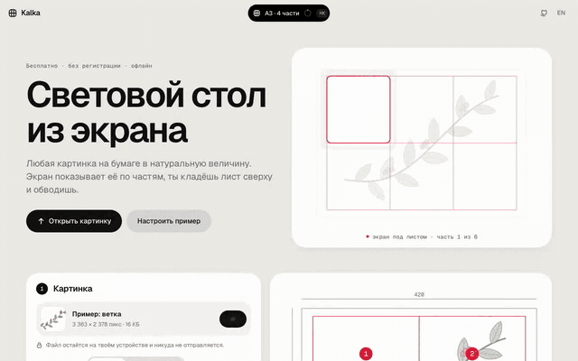

# kalka

световой стол из экрана ноутбука или планшета. любая картинка переносится на бумагу в натуральную величину: экран показывает её по частям, ты кладёшь лист сверху и обводишь.

**[открыть kalka →](https://kvyvo.github.io/kalka/)** · бесплатно, без регистрации, файл не покидает устройство · [english below](#english)


## зачем

плакат на ватмане А1, декорации к утреннику, эскиз для муралa, выкройка, перевод рисунка на ткань или под тату. рисовать от руки в масштабе сложно, проектора нет, а у телефонных AR-приложений свою картинку загрузить можно только по подписке, и изображение дрожит.

у ноутбука уже есть яркий плоский экран. осталось показать на нём рисунок ровно в миллиметрах и по кусочку за раз.

## что умеет

- **любой файл**: JPG, PNG, SVG, PDF, перетаскиванием, кнопкой или вставкой из буфера. размер из SVG (`width="380mm"`) и PDF подхватывается сам
- **любой лист**: A4…A0, горизонтально или вертикально, или свой размер. рисунок вписывается с полями, задаётся шириной в см или берётся из файла
- **натуральная величина**: экран определяется по разрешению (MacBook Air/Pro, iPad, Surface), для остальных вводится диагональ. проверка по любой пластиковой карте 85,6 × 54 мм: рамку можно двигать кнопками или тянуть за край
- **число частей само**: подбирается минимальное деление, при котором часть с запасом помещается на экран. можно задать вручную
- **режим обводки**: белый экран, текущая часть в красной рамке, соседние бледнее, за краем листа серая зона — лист совмещается по краю, без разметки. крестики в узлах для тех, кто размечает. отрезок 100 мм для проверки линейкой
- **замок**: ватман на клавиатуре не нажмёт пробел и не перелистнёт часть, касания на iPad не нажмут кнопки. снимается удержанием
- **контур из фото**: оператор Собеля в Web Worker, ползунок толщины. режим Ч/Б для рисунков, где линии уже есть. поворот и зеркало (для линогравюры и трафаретов)
- **печать на A4**, если материал не просвечивает: рисунок режется на листы в масштабе 1:1 с нахлёстом 10 мм для склейки и контрольным отрезком 50 мм
- **прогресс и проект**: отмеченные части, настройки и сам файл сохраняются в браузере (IndexedDB). проект можно выгрузить файлом `.kalka` и открыть на другом устройстве
- **офлайн** (PWA), **RU/EN**, светлая и тёмная тема, палитра команд <kbd>⌘K</kbd> / <kbd>Ctrl K</kbd>, всё проходится с клавиатуры


## дизайн и движение



тёплый серый холст, чёрно-белые компоненты, один акцентный цвет (красный — сетка и «включено»), шрифт Geist, одна толщина линий у всех иконок. всё движется на пружинах, максимум с маленьким перелётом; никаких градиентов, свечений и «прыгающих» easing.

- **одна фигура — много состояний.** island наверху страницы — это сводка проекта («A3 · 6 частей» и кольцо прогресса), лоадер, галочка, тост, палитра команд, подтверждение и зона для брошенного файла. это один элемент: у него пружинят ширина, высота, радиус и цвет, а содержимое меняется с коротким размытием. так же устроены кнопка файла (надпись → лоадер → галочка) и панель в режиме обводки (полная → компактная пилюля → замок)
- **жидкие индикаторы.** у переключателей края бегунка едут на разных пружинах: передний убегает вперёд, задний догоняет, и индикатор на лету растягивается. у тумблеров ручка при нажатии расширяется, а при переключении растягивается так же
- **резинка.** слайдеры за краем тянутся и истончаются, после отпускания пружинят обратно; рамка калибровки тянется прямо за край
- **камера.** план листа — сцена: при смене формата лист и рисунок пружинят к новым размерам, сетка прорисовывается линиями, номера частей появляются по очереди, подсказка над частью перетекает от части к части
- **переход.** кнопка или часть на плане вырастает в белый экран обводки, а при выходе экран сжимается обратно в свою часть
- **текст** меняется со сдвигом и размытием: старая строка уходит, новая приходит
- в hero без слов показан принцип: экран под листом подсвечивает одну часть, её обводят, экран переезжает дальше

под капотом `js/motion.js`: пружина в замкнутой форме (как `duration/bounce` в SwiftUI), несколько значений в одном `requestAnimationFrame`, прерывание с сохранением скорости, выборка пружины в CSS `linear()` для Web Animations. при «уменьшить движение» в системе всё встаёт на место сразу.

## клавиши в режиме обводки

| клавиша | что делает |
|---|---|
| <kbd>←</kbd> <kbd>→</kbd> <kbd>↑</kbd> <kbd>↓</kbd> | соседняя часть |
| <kbd>Enter</kbd> | часть готова, к следующей необведённой |
| <kbd>Пробел</kbd> / <kbd>⇧ Пробел</kbd> | следующая / предыдущая по порядку |
| <kbd>1</kbd>…<kbd>9</kbd>, <kbd>⌘K</kbd> + номер | перейти к части |
| <kbd>C</kbd> <kbd>G</kbd> <kbd>D</kbd> | цвет / сетка / бледнее вокруг |
| <kbd>L</kbd> | замок, снять — удерживать <kbd>Esc</kbd> или кнопку |
| <kbd>F</kbd>, <kbd>Esc</kbd> | во весь экран, выход |

клавиши работают и на русской раскладке.

## как это устроено

статический сайт без сборки и фреймворков: ES-модули, ~2 200 строк JS. зависимость одна и только для разработки (Playwright).

```
index.html, css/app.css
js/geometry.js   лист, вписывание, сетка, подбор числа частей, листы для печати — чистые функции
js/screens.js    таблица экранов: размер панели в мм и режимы масштабирования ОС
js/spring.js     пружина в замкнутой форме (как SwiftUI duration/bounce)
js/motion.js     пружинные значения, смена текста с размытием, морф одной фигуры, рост в весь экран
js/ui.js         переключатели с жидким индикатором, тумблеры, слайдеры-резинки
js/island.js     island: сводка, лоадер, тосты, палитра ⌘K, подтверждения, приём файла
js/hero.js       иллюстрация принципа в шапке
js/outline.js    контур: серый → размытие 3×3 → Собель → мягкий порог (в воркере)
js/image.js      открытие файлов, pdf.js по требованию, поворот и зеркало на canvas ≤ 16,7 Мпикс
js/trace.js      режим обводки
js/app.js        настройка, план листа, калибровка, печать, проект
sw.js            офлайн-кэш
```

**масштаб.** в CSS `1mm` всегда равен 3,78 px, к реальному экрану это не привязано. поэтому px/мм считается как «ширина экрана в CSS px / ширина панели в мм». формула верна при любом масштабе macOS и Windows. у некоторых режимов пиксели не квадратные (MacBook Air 15″ в 1710 × 1112: разница по осям 0,5 %), поэтому x и y считаются отдельно. одинаковую сигнатуру экрана могут давать разные модели, поэтому таблица возвращает кандидатов, а человек подтверждает картой.

**переход между частями** — пружина на `transform: translate`, без перерастеризации огромного слоя. координаты округляются до физического пикселя, иначе линии мылятся.

## запуск и тесты

```
python3 tools/serve.py        # http://localhost:5173
npm test                      # 25 модульных тестов: геометрия, экраны, пружины, контур, склонения, сборка
npm run e2e                   # 15 сценариев по чек-листу тестирования, Chromium
V=abc npm run build           # сборка в _site/: к модулям, стилям и воркеру дописывается ?v=abc
SITE=_site BROWSER=webkit npm run e2e   # те же сценарии на сборке, движок Safari
```

CI гоняет сценарии на собранном сайте в Chromium и WebKit и выкладывает ровно эту сборку. Версия в адресах нужна потому, что браузер может держать в кэше часть файлов прошлой выкладки: без неё Safari собирал страницу из старых и новых модулей и падал на импорте. Страница и `app.js` несут номер сборки; если они разошлись (старая страница из кэша), страница один раз перезагружается, отдав управление новому service worker.

e2e проверяет в том числе: рамку карты на MacBook Air 13″ (433 px ± 1,5), ввод диагонали на ноутбуке 1366 × 768, подхват размера A4 из PDF, замок, раскладку, белый стол в тёмной теме, печать 1:1, отсутствие горизонтального скролла на телефоне и Mac-инструкций на Windows. один сценарий идёт с включённой анимацией и проверяет, что пружины приземляются ровно в цель: индикатор под выбранным листом, камера плана на новом формате, island снова пилюля, после смены текста не осталось «призраков».

скриншоты для README снимаются с настоящей страницы: `node tools/shots.mjs`. GIF — сцена `tools/motion.html`: 120 bpm, 7 тактов, на каждую долю что-то происходит; каждый кадр — чистая функция времени `seek(t)` на пружинах в замкнутой форме, последний кадр равен первому. `node tools/motion.mjs` рендерит её по 4 подкадра на кадр со смазом через ffmpeg `tmix`, 50 fps (быстрее GIF в браузерах не играет).

## откуда взялось

из одноразовой страницы, сделанной, чтобы перенести на ватман А1 одну схему с экрана MacBook Air. она работала на двух моделях ноутбука и с одной картинкой. перед переписыванием было три независимых разбора: аналоги и идеи, совместимость и дизайн-система, и тест глазами шести пользователей (студентка со старым ноутбуком, учительница, муралист, мама с iPad, вышивальщица, студент-архитектор). из них выросли автоопределение экрана, замок, край листа вместо обязательной разметки и печать на A4.

## дальше

- PDF постранично и вектором в полном разрешении для A0
- «раскраска по номерам»: квантизация цветов и номера в областях
- печать плана разметки с размерами

## лицензия

MIT

---

## english

**kalka** turns a laptop or tablet screen into a light table. Pick any picture (JPG, PNG, SVG, PDF) and a sheet (A4…A0 or custom). Kalka shows the drawing part by part at true physical size: lay the paper on the screen and trace.

- screen scale from a table of real panels (MacBook, iPad, Surface) or the diagonal, verified with any bank card
- the number of parts is chosen so each part fits the screen; the paper edge is visible on screen, so no pencil grid is required
- input lock against paper pressing keys, outline from photos (Sobel in a worker), mirror, print on A4 at 1:1 with overlap, offline PWA, RU/EN, ⌘K palette
- one shape, many states: the island at the top is the project summary, a loader, a check, a toast, the ⌘K palette and confirmations, morphing on springs with blurred content swaps; liquid segmented indicators, stretching switch knobs, rubber-band sliders, a camera that follows the sheet
- no build step, vanilla ES modules; unit tests with `node --test`, browser acceptance tests with Playwright

**[open kalka →](https://kvyvo.github.io/kalka/)**
